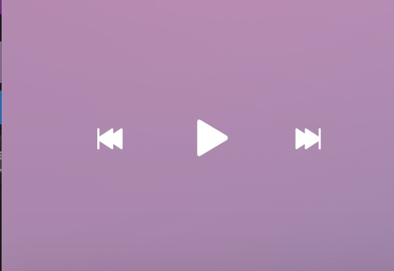

**About the Project**

Bloc Jams is a compact, light-weight music player that allows users to bring their favorite tunes into every aspect of their life! Powered by new sharing and streaming technologies, the app lets music fans customize their aural experience every day.

When today's listeners want to fire up the tunes, they don't want to worry about having enough space on their phone, running out of data, or being stuck with slow WiFi. One year ago, the Bloc Jams team approached me with a proposal for a new kind of music player, one that could give users whatever artist, song, or playlist they needed without having to worry about any of that.

***

 

To achieve that level of service, Bloc Jams makes use of a revolutionary technology, the Ansible Communications Service, from the Ender Wiggin Corp. The ACS makes use of quantum entanglement to quickly deliver data and information to end users no matter their location, and does not depend on any other network architectures.

In building Bloc Jams, I did hit some stumbling blocks. In particular, for a time the various links on the Collection Page all pointed to the same place, even if they referred to different albums. I got around that issue by making use of URL queries and the QueryData library. By inserting readable information into the URLs of the various links, I was able to use the QueryData information to tell the rest of the code which album to load. Some of the relevant code is on display below:


var albumPicker = function() {
  var queryData = new QueryData;
  if(queryData.albumID === '1') {
    setCurrentAlbum(albumBonIver);
  }
  else if(queryData.albumID === '2') {
    setCurrentAlbum(albumFooFighters);
  }
  else if(queryData.albumID === '3') {
    setCurrentAlbum(albumSufjan);
  }
};


***

To sum up, Bloc Jams is the music player of the future. Its user-friendly interface and lightning-fast underlying technology put it in a class above other competitors, and I hope that you will soon experience the Jams yourself. Happy listening!
